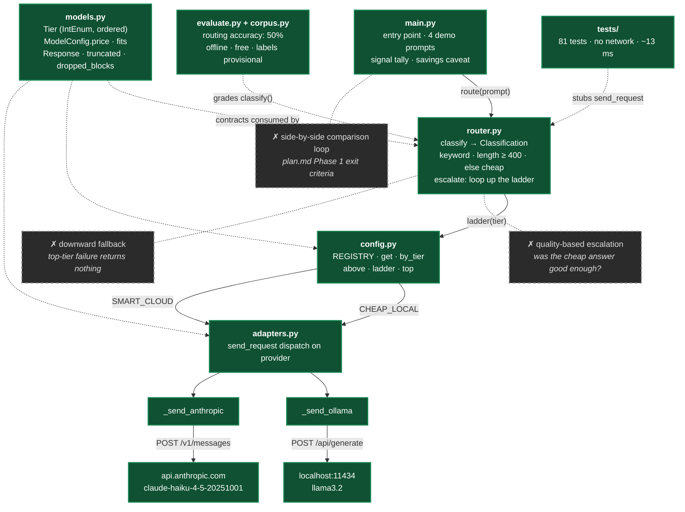

# [AI] Architecture — what exists vs. what is missing

[AI] Written by the AI assistant on 2026-08-03 at Luis Chavez's request.
[AI] Every line in this file is `[AI]`-authored unless later edited and marked `[LC]`.
[AI] Purpose: one picture of how the modules connect and where the holes are.
[AI] Companion to `plan.md` (the design) and `progress.md` (the checklist).
[AI] This file is the map; `progress.md` remains the authority on *status*.

[AI] Verified 2026-08-03 by running `python main.py` against live Ollama with no
[AI] `.env` present. Status marks below reflect that run, not documentation claims.

[AI] **Refreshed 2026-08-19**, covering work-queue items 9-17 from the two-week
[AI] catch-up period (2026-08-02 to 08-19) rather than a single session. The
[AI] diagram now shows the tier ladder, the test suite, and the offline
[AI] evaluator; the "expensive → cheap fallback" row of the missing-pieces table
[AI] was rewritten, because the hardcoded gate it described no longer exists.
[AI] Re-verified by the same method: a live `python main.py`, plus
[AI] `python -m unittest discover` and `python evaluate.py`.

---

## [AI] Legend

| mark | meaning |
|---|---|
| ✅ **verified** | executed successfully and observed — not merely written |
| ⚠️ **unrun** | code exists and imports cleanly, but has never made a real call |
| 🔴 **blocked** | external dependency unavailable |
| ✗ **missing** | not built; the dashed boxes below |

---

## [AI] Rendered diagram



---

## [AI] Plain-text diagram

[AI] The same graph, kept because the mermaid block above only renders on GitHub —
[AI] this one survives `cat`, an editor, and a terminal.

```
                        ┌──────────────────┐
                        │     main.py      │  ✅ runs
                        │  4 demo prompts  │
                        └────────┬─────────┘
                                 │ route(prompt)
                                 ▼
                  ┌──────────────────────────────┐
                  │          router.py           │  ✅ all 3 branches fire
                  │ classify() → Classification  │
                  │   • complexity keyword       │
                  │   • length ≥ 400 chars       │  both signals recorded,
                  │   • else → cheap             │  not just the first to fire
                  │                              │
                  │  escalate: loop up the ladder│  ✅ N tiers, no branches
                  └──────────┬───────────────────┘  ⚠️ climbs up only
                             │ ladder(tier)
                             ▼
                      ┌──────────────┐
                      │  config.py   │  ✅ REGISTRY + get() + by_tier()
                      │              │  ✅ above() + ladder() + top()
                      └──┬────────┬──┘
               CHEAP_LOCAL│        │SMART_CLOUD
                          ▼        ▼
                  ┌────────────────────────┐
                  │      adapters.py       │
                  │    send_request()      │  ✅ dispatch verified
                  └───┬────────────────┬───┘
                      │                │
              _send_ollama       _send_anthropic
              ✅ VERIFIED        ✅ VERIFIED 2026-08-19
              (3 failure modes    (live call; shape
               observed live)      matched the docs,
                      │            no change needed)
                      ▼                │
            localhost:11434 ✅         ▼
            llama3.2 running    api.anthropic.com ✅
                                claude-haiku-4-5-20251001

        ┌─────────── models.py ───────────┐  ✅ consumed by every box above
        │  Tier (IntEnum — ordered)       │
        │  ModelConfig.price() + fits()   │
        │  Response + .failure() + .summary()
        └─────────────────────────────────┘

        ┌─────────── tests/ ──────────────┐  ✅ 81 tests, ~13 ms, no network
        │  stubs router.send_request      │     (adapters themselves untested)
        └─────────────────────────────────┘
```

---

## [AI] Missing pieces, and where each one attaches

| ✗ missing | attaches at | why it matters |
|---|---|---|
| **Quality-based escalation / answer-quality metric** | `router.py` — after the cheap call returns | The project's actual thesis, and work-queue item 12. Still nothing measures whether an answer was *good*; routing is decided before the call, so a false positive is structurally undetectable at runtime. Item 15 narrowed this: routing accuracy against human labels is now measured offline (50%, 0% on every adversarial class), which quantifies the gap without closing it. Item 16 catches the degenerate case only — an empty reply now escalates. |
| **Tool calling / structured output** | `adapters.py` — the content-block parser | Non-text blocks are now *recorded* (`Response.dropped_blocks`) instead of silently discarded, but they are still not handled. `llama3.2` reports as tools-capable, so the cheap tier could participate if a later phase wants this. |
| **Downward fallback** | `router.py` — the `ladder()` loop | The ladder climbs **up** only, so a top-tier failure still returns no answer. Answering with a *worse* model rather than nothing is a product decision, not an oversight — pinned by `test_top_tier_failure_has_nowhere_to_climb` so it stays a choice. *(Updated during the catch-up: the old entry here described a hardcoded `tier == "cheap"` gate. That gate is gone — see progress.md item 10.)* |
| **Adapter tests** | `tests/` | The suite stubs `send_request`, so `_send_ollama` and `_send_anthropic` are covered only by running `main.py` against live providers. Closing this means recorded fixtures of real provider JSON, or a stub HTTP transport. Largest hole in the suite. |
| **Side-by-side comparison loop** | `main.py` | `plan.md:91` names this as Phase 1's exit criteria: one loop sending the *same* prompt to both configs and printing both `Response`s. `main.py` sends each prompt to exactly one tier, so the criterion is unmet. |
| **Latency-aware routing** | `router.py` — `classify()` | `Response.latency_ms` has existed since Phase 1 and no decision reads it. The 2026-08-19 run measured local at ~2.6 s against hosted at 5.6–7.9 s, so the signal is real and unused. |

[AI] *Removed from this table during the catch-up:* **`.env` /
[AI] `ANTHROPIC_API_KEY`**, which was listed as the single blocker for
[AI] `_send_anthropic`. The key exists, the adapter has run live, and `plan.md`
[AI] build-order step 4 is demonstrated.

---

## [AI] Observed behaviour, measured 2026-08-19 — both providers live

[AI] `python main.py` with Ollama running and a real `ANTHROPIC_API_KEY`:

```
"What is the capital of France?"   → CHEAP     → llama3.2 ✅  40 tok,  2578 ms, $0.000000
"Design a distributed rate..."     → EXPENSIVE → haiku-4.5 ✅ 1025 tok, 5631 ms, $0.005025
"Name three primary colors."       → CHEAP     → llama3.2 ✅  48 tok,  2625 ms, $0.000000
"I have a Python service that..."  → EXPENSIVE → haiku-4.5 ✅ 1115 tok, 7853 ms, $0.005115

saved $0.000192 (2%)
```

[AI] **Every box in the diagram above is now ✅ except the dashed ones.**
[AI] `_send_anthropic` went from ⚠️ unrun to verified with no code change — the
[AI] response shape matched what the documentation described.

[AI] **The savings figure fell from 100% to 2%, and the 2% is the real one.** The
[AI] earlier 100% was the artifact this file warned about: free local calls were
[AI] the only successes. See `progress.md` → "First live end-to-end run" for why
[AI] 2% is the expected shape rather than a disappointment — an expensive-routed
[AI] prompt saves nothing by construction, so savings come only from prompts
[AI] routed cheap, which are the cheap ones anyway.

[AI] **New: latency is a real routing signal and nothing uses it.** Local calls
[AI] returned in ~2.6 s, hosted in 5.6–7.9 s. `Response.latency_ms` has carried
[AI] this since Phase 1 and no routing decision reads it. `plan.md` predicted
[AI] "cheap models should win here too"; they do, by roughly 3×.

[AI] **New: `max_tokens=1000` is the binding constraint on both hosted calls.**
[AI] Both returned *exactly* 1000 output tokens and both answers are truncated
[AI] mid-sentence. Every expensive call therefore bills the full cap at $5.00/M
[AI] output regardless of whether the answer finished — the single largest lever
[AI] on the cost numbers, and an unexamined `ModelConfig` default.

---

## [AI] Observed behaviour, 2026-08-03 (historical — no API key)

[AI] `python main.py`, live Ollama, no `.env`:

```
"What is the capital of France?"   → CHEAP     → llama3.2 ✅  40 tok, 2473 ms
"Design a distributed rate..."     → EXPENSIVE → FAILED (key unset), no fallback
"Name three primary colors."       → CHEAP     → llama3.2 ✅  48 tok,  701 ms
"I have a Python service that..."  → EXPENSIVE → FAILED (key unset), no fallback
```

[AI] **Caveat on the savings figure.** The run prints `saved $0.000192 (100%)`. That
[AI] will read 100% on every run while the only *successful* calls are free local
[AI] ones — a failed call prices `0` in / `0` out, so it contributes nothing to
[AI] either the actual or the baseline total (`router.py:126`). The arithmetic is
[AI] correct; the headline only becomes meaningful once an expensive call succeeds.
